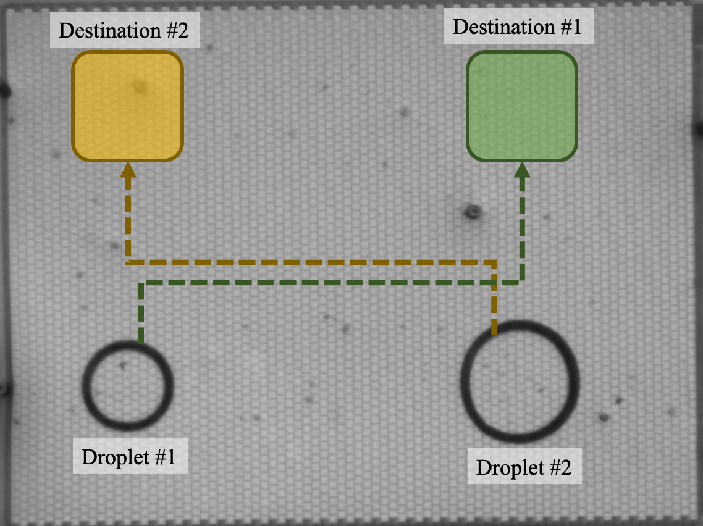
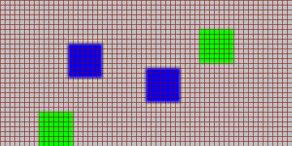

# meda-env
A PettingZoo Gym-based environment for microelectrode-dot-array (MEDA) biochips.

## Overview
This environment simulates the dynamic environment of a MEDA biochip. A fabricated MEDA biochip is shown below, where two droplets need to be transported to the destinations. However, it is possible that the two droplets might collide, resulting in unwanted reagent contamination.



This issue can be solved by a trained MARL agent. We recorded how an agent transports the two droplets to their destinations.



For furhter information, please reference our ICML'21 paper named "Parallel Droplet Control in MEDA Biochips using Ｍulti-Agent Reinforcement Learning".

## Training
First, install all the required libraries when you run meda\_env/train.py. Then you can find the training result under the 'log' directory.

## Cite This Work
To cite this work in publications:

```
@inproceedings{liang2021parallel,
  title = {Parallel Droplet Control in MEDA Biochips using Ｍulti-Agent Reinforcement Learning},
  author = {Liang, Tung-Che and Zhou, Jin and Chan, Yun-Sheng and Ho, Tsung-Yi, and Chakrabarty, Krishnendu and Lee, Chen-Yi},
  booktitle={International Conference on Machine Learning (ICML)},
  year={2021}
}
```
